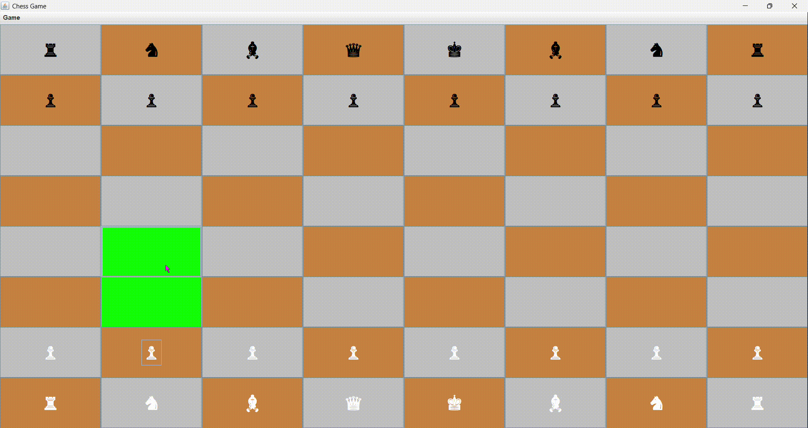

 

# **Two-Player Chess Game**

## **Project Overview**
This project is a two-player chess game implemented in Java using the **Swing** framework for the graphical user interface (GUI). It supports all standard chess rules and offers an intuitive GUI where players can move pieces, track game state, and enjoy an interactive chess experience.

## Images for More Clarification

## **Features**
- Full implementation of chess rules (check, checkmate, stalemate, castling, en passant, promotion, etc.).
- Java Swing-based GUI for a smooth user experience.
- Supports two human players playing on the same machine.
- Visual highlighting of valid moves for selected pieces.
- Interactive board with real-time game state updates.
  
## **File Structure**
- **`ChessGame.java`**: Manages the overall game logic and flow.
- **`ChessBoard.java`**: Represents the chessboard and handles the game state.
- **`ChessGameGUI.java`**: Implements the graphical user interface using Java Swing.
- **`ChessSquareComponent.java`**: Represents individual squares on the chessboard.
- **`Piece.java`**, **`PieceColor.java`** and **`Position.java`** are other neccessary Files setting colors for each piece and setting and initializing the positions.
- **Piece Files**:
  - `Bishop.java`
  - `Knight.java`
  - `Queen.java`
  - `King.java`
  - `Pawn.java`
  - `Rook.java`
  - These files represent the individual chess pieces and their respective movement logic.
 
## **How to Run**
- Place all the .java files in one folder and compile it.
- Then run the ChessGameGUI.java file to run the Chess Game.

## **Prerequisites**
To compile and run this project, you will need:
- **Java Development Kit (JDK)** (version 8 or higher)
- A Java Integrated Development Environment (IDE) like **IntelliJ IDEA**, **Eclipse**, or **NetBeans**
- - Java 
- Java Swing 
- JUnit (optional)
- Git (optional but recommended)
- IntelliJ IDEA (optional)

